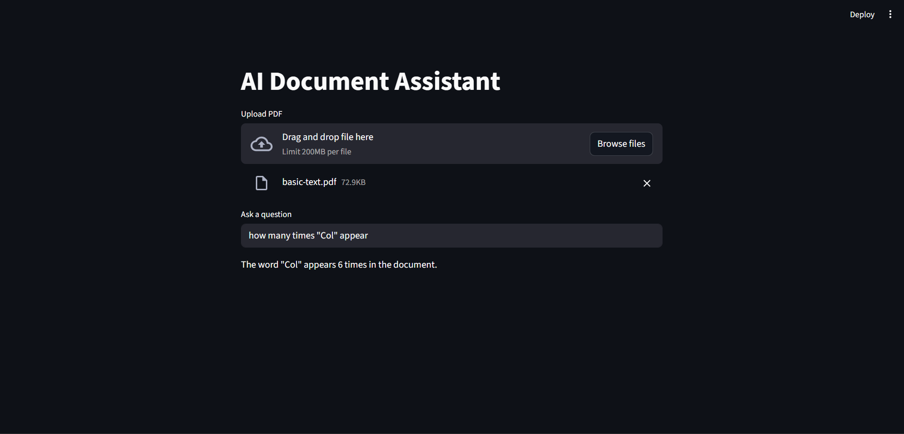

# AI Document Analyzer

An AI-powered system that can analyze PDF documents,
answer questions, and perform text analytics.

## Features

- PDF document question answering
- Hybrid reasoning (LLM + Python logic)
- Keyword counting
- Semantic search

## Tech Stack

Python
LangChain
FAISS
Transformers
Streamlit

## Architecture

Document → Chunking → Embedding → Vector DB → Retrieval → LLM

## Installation

pip install -r requirements.txt

## Demo

Upload a PDF document and ask questions about its content.

## Run

streamlit run app.py

## Example Questions

What does this document demonstrate?
How many times "Row" appears?

## Future Improvements

Multi-PDF search
Chat memory
Document summarization
